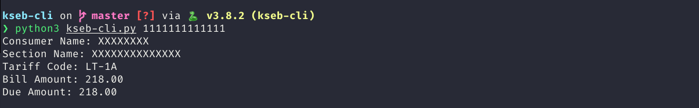

A simple command line application to fetch kseb electricity payment dues as it takes too much time and effort to do this manually. ;)

Originally written for i3blocks.

The code is untested and there is no guarantee that it will not break when the webpage changes.

### Installation
```bash

git clone "git@github.com:4lhc/kseb-cli.git"
cd kseb-cli
python3 -m venv kseb-cli #requires python3-venv
pip install -r requirements.txt
sudo apt install firefox-geckodriver

```

### Run
```bash

python3 kseb-cli.py <customer-number>

```

